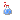
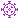

# VacMan - Lighthouse Project 20/21








This repository contains my game for the [CAU lighthouse project](https://github.com/ProjectLighthouseCAU).
It is now migrated to use the [Jighthouse](https://github.com/ProjectLighthouseCAU/jighthouse)
library to communicate with the Lighthouse.

The task was to create a PacMan-like game with a corona/vaccination theme.

I wrote this in my first semester of computer science in college.
The quality of my code proves this.
However, I put in much effort (especially into a pleasant experience and visuals)
and was quite pleased with the result.

I continued some work on it a few years later,
using the knowledge I gained in college and industry.
These changes however are mostly refactors improving usability and maintainability
and nothing reworking the game or fundamentally changing it.
I do plan on some bug fixes and general improvements though.

## Start the game

To run the game locally just run:

```bash
./gradlew run
```

The game automatically tries to connect to the Lighthouse
using the environment variables `LH_USERNAME` and `LH_TOKEN`.  
Run the game with these set to play on the Lighthouse.